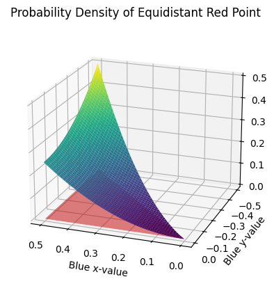

# Beside the Point
*https://www.janestreet.com/puzzles/current-puzzle/*

Two random points, one red and one blue, are chosen uniformly and independently from the interior of a square. To ten decimal places, what is the probability that there exists a point on the side of the square closest to the blue point that is equidistant to both the blue point and the red point?

## Solution

$8 \times \int_{0}^{0.5} \int_{-x_b}^{0} x_b \left|{y_b}\right| - \left(x_b - 1\right) \sqrt{y_b^{2} + \left(1 - x_b\right)^{2} - \left(x_b - 1\right)^{2}} + \left(x_b^{2} + y_b^{2}\right) \text{asin}{\left(\frac{x_b}{\sqrt{x_b^{2} + y_b^{2}}} \right)} - \frac{\pi \left(x_b^{2} + y_b^{2}\right)}{2} - \left(y_b^{2} + \left(1 - x_b\right)^{2}\right) \text{asin}{\left(\frac{x_b - 1}{\sqrt{y_b^{2} + \left(1 - x_b\right)^{2}}} \right)} - \frac{\pi \left(y_b^{2} + \left(1 - x_b\right)^{2}\right)}{2} + \frac{\pi \left(x_b^{2} + 2 y_b^{2} + \left(1 - x_b\right)^{2}\right)}{4} \ dy_b \ dx_b$

